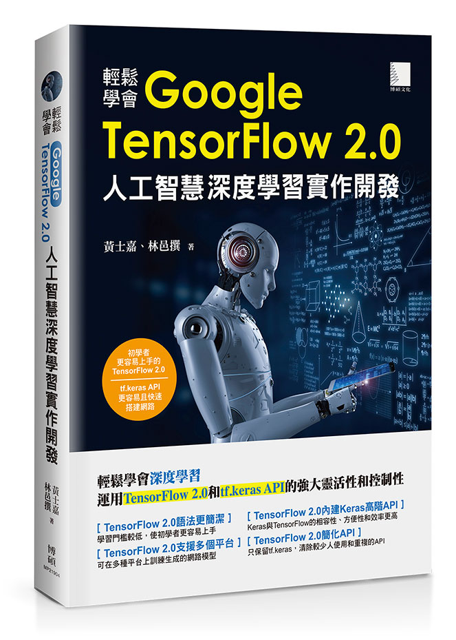

# 輕鬆學會 Google TensorFlow 2.0 人工智慧深度學習實作開發 

##  安裝

- Requirements
    - Jupyter NoteBook
    - TensorFlow == 2.0.0-beta1
    - TensorFlow Datasets
    - Tensorflow Hub
    - Tensorflow Addons
    - Numpy
    - Pandas
    - Matplotlib
    - OpenCV

## 作者
黃士嘉

　　【經歷】

　　◎國立臺北科技大學電子工程系 教授

　　◎加拿大安大略理工大學 國際客座教授

　　◎IEEE Sensors Journal 國際期刊編輯

　　◎IEEE BigData Congress 國際會議主席

　　◎IEEE CloudCom Conference 國際會議主席

　　【獲獎】

　　◎經濟部第5屆國家產業創新獎

　　◎ACM臺灣分會，李國鼎青年研究獎

　　◎國立臺北科技大學電資學院，院傑出研究獎

　　◎國立臺北科技大學，校傑出研究獎

　　◎國立臺北科技大學，Dr.Shechtman年輕學者獎

林邑撰

　　【學歷】

　　◎國立臺北科技大學電子工程系碩士

## 購買連結

- [天瓏書局](https://www.tenlong.com.tw/products/9789864344178)
- [博客來](https://www.books.com.tw/products/0010832030)

